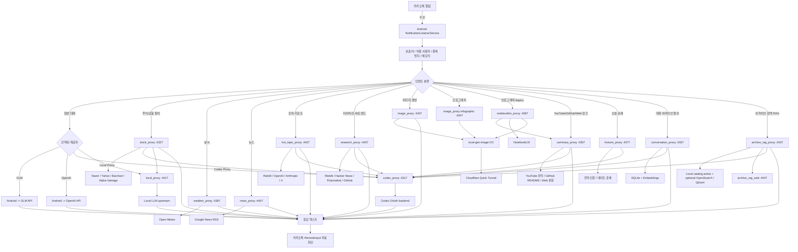

<div align="center">


<h1 id="top">🤖 코비서 · Coreline Kakao Chatbot V3</h1>

<p>
  <b>내 손 안의 똑똑한 인공지능 비서</b><br/>
  <sub>Android · 카카오톡 자동응답 · 14개 프록시 스택 · Codex / Local LLM 공존 운영</sub>
</p>

<!-- ┌──────── Tech Stack ────────┐ -->
<p>
  
  
  
  
  
  
</p>

<!-- ┌──────── LLM / Data ────────┐ -->
<p>
  
  
  
  
</p>

<!-- ┌──────── Status / Meta ────────┐ -->
<p>
  
  
  
  
</p>

<!-- ┌──────── Quick Navigation ────────┐ -->
<p>
  <a href="#-주요-기능-features"><b>🚀 기능</b></a> &nbsp;·&nbsp;
  <a href="#%EF%B8%8F-시스템-아키텍처-architecture"><b>🏗️ 아키텍처</b></a> &nbsp;·&nbsp;
  <a href="#-빠른-시작-getting-started"><b>⚡ 빠른 시작</b></a> &nbsp;·&nbsp;
  <a href="#-프록시-api-요약"><b>📡 API</b></a> &nbsp;·&nbsp;
  <a href="#-문서-맵-documentation-map"><b>📚 문서</b></a> &nbsp;·&nbsp;
  <a href="#-라이선스-license"><b>📜 라이선스</b></a>
</p>

<br/>

<p>
  <em>안드로이드 앱이 카카오톡 알림을 직접 수신하고, 선택한 LLM 경로로 답변을 생성해 자동 회신하는<br/><b>Android 중심 개인 비서</b> 프로젝트입니다.</em>
</p>

</div>

---

## 📑 목차 (Table of Contents)

<table>
<tr>
<td valign="top" width="25%">

**🎯 시작하기**
- [📖 개요](#-개요-overview)
- [✨ 주요 기능](#-주요-기능-features)
- [🚀 빠른 시작](#-빠른-시작-getting-started)
- [🧪 빠른 점검](#-빠른-점검-명령-smoke-test)

</td>
<td valign="top" width="25%">

**🏗️ 아키텍처 / API**
- [🏗️ 시스템 아키텍처](#%EF%B8%8F-시스템-아키텍처-architecture)
- [📂 저장소 구조](#-저장소-구조-repository-structure)
- [🧭 현재 동작 모드](#-현재-동작-모드-current-runtime-modes)
- [📡 프록시 API](#-프록시-api-요약)

</td>
<td valign="top" width="25%">

**📊 상세 / 운영**
- [📈 금융 데이터 소스](#-금융-데이터-소스-전략)
- [🧠 자연어 질의 범위](#-자연어-질의-범위)
- [🔒 보안 메모](#-보안-메모-및-운영-제약)
- [🧰 운영 보조 기능](#-운영-보조-기능)

</td>
<td valign="top" width="25%">

**📚 참고**
- [🗄️ 아카이브 상세](#%EF%B8%8F-대화-아카이브-상세-conversation-proxy)
- [🖼️ 이미지 상세](#%EF%B8%8F-이미지-생성-상세-image-proxy)
- [📚 문서 맵](#-문서-맵-documentation-map)
- [📜 라이선스](#-라이선스-license)

</td>
</tr>
</table>

---

## 📖 개요 (Overview)

이 프로젝트는 안드로이드 기기가 카카오톡 알림을 직접 수신한 뒤, 호출어를 감지하고, 선택된 제공자 경로로 질의를 보내 자동 답장을 생성하는 개인용 자동응답 시스템입니다.

현재 구조의 핵심 컴포넌트는 다음과 같습니다.

- `android_client`
  - 실제 사용자 표면
  - 카카오 알림 수신, 호출어 검사, 허용 사용자 필터, 메모리, 자동 회신 담당
- `codex_proxy`
  - Mac 호스트에 로그인된 Codex OAuth 상태를 이용하는 로컬 프록시
- `local_proxy`
  - OpenAI-compatible local upstream을 `codex_proxy` 호환 계약으로 감싸는 sibling LLM 프록시
  - 기본 포트 `4417`, 기본 upstream `http://127.0.0.1:1337/v1`, 기본 모델 `gemma-4-E4B-it-IQ4_XS`
  - Android 일반 대화 provider와 host-side feature proxy backend를 모두 로컬 LLM로 전환할 수 있는 핵심 경로
- `stock_proxy`
  - 주식/ETF/섹터/거시/선물 질의를 데이터 기반으로 해석하고 선택된 host-side LLM backend(`codex|local`)에 요약을 위임하는 금융 프록시
- `conversation_proxy`
  - 특정 카카오 방 대화를 7일간 저장하고 의미 기반 검색/요약/통계를 수행하는 대화 아카이브 프록시
- `image_proxy`
  - `local-gen-image-OC`를 래핑해 이미지 생성, QC, OG 페이지 링크 생성, quick tunnel 공개를 담당하는 이미지 프록시
- `summary_proxy`
  - YouTube / GitHub / Web 링크를 받아 구조화 요약을 반환하는 프록시
- `notebooklm_proxy`
  - legacy/optional 인포그래픽 프록시
  - `코비서 인포 <URL>`의 구형 경로를 보존하지만 기본 라우팅에서는 사용하지 않음
- `fortune_proxy`
  - `코비서 운세`, `코비서 오늘 운세`, `코비서 쥐띠 운세`, `코비서 물병자리 운세`, `코비서 A형 운세` 같은 요청을 받아 띠별/별자리/혈액형 운세 응답을 생성하는 운세 프록시
- `weather_proxy`
  - `코비서 오늘 서울 날씨`, `코비서 부산 날씨` 같은 명시형 날씨 요청을 받아 Open-Meteo 기반 현재 날씨/짧은 예보 요약을 반환하는 프록시
- `news_proxy`
  - `코비서 오늘 뉴스`, `코비서 경제 뉴스`, `코비서 IT 뉴스` 같은 명시형 뉴스 요청을 받아 카테고리 브리핑을 반환하는 프록시
- `hot_topic_proxy`
  - `코비서 토픽`, `코비서 오늘 토픽`, `코비서 토픽 7일`, `코비서 토픽 재생성` 요청을 받아 Reddit / 공식 발표 / 선택적 X 공개 신호를 묶은 짧은 토픽 리포트를 생성하는 프록시
- `research_proxy`
  - `코비서 리서치`, `코비서 조사`, `코비서 트렌드` 요청을 받아 Reddit / Hacker News / Polymarket / GitHub 공개 신호를 묶은 주제 기반 리서치 프록시
- `archive_rag_proxy`
  - `archive_rag_data`의 정규화 아카이브를 local catalog/chunk 검색 + LLM 합성 응답으로 노출하고, 설정 시 OpenSearch/Qdrant sparse/dense 검색을 함께 쓰는 검색형 RAG 백엔드 프록시
- `archive_rag_web`
  - `archive_rag_proxy`를 사용하는 웹 챗 UI / BFF (라이트·다크 테마, 세션, citation panel) 프록시
- `archive_rag_embedding`
  - sentence-transformers / 해싱 기반 벡터 임베딩 서비스 (Docker)
- `archive_rag_data`
  - 정규화된 대화(canonical), SQLite 카탈로그(catalog), 인덱스 export 저장소
- `pipeline-notebooklm`
  - `notebooklm_proxy`가 내부에서 사용하는 vendored NotebookLM client / pipeline 소스

이 프로젝트는 단순한 “LLM 답장기”가 아니라, 아래 2가지를 동시에 목표로 둡니다.

- 일반 대화 자동응답
- 데이터 근거 기반 금융/주식 브리핑
- 특정 방 대화 아카이브와 의미 기반 요약

---

## ✨ 주요 기능 (Features)

<div align="center">

| 💬 | 🌤️ | 📰 | 🔥 | 🔎 | 🧠 | 🗂️ | 📊 |
|:---:|:---:|:---:|:---:|:---:|:---:|:---:|:---:|
| 자동응답 | 날씨 | 뉴스 | 토픽 | 리서치 | 문맥 메모리 | 대화 아카이브 | 바이브인포 |

| 🖼️ | 🔗 | 📊 | 🔮 | 🔀 | 📈 | 🛡️ | ⚙️ |
|:---:|:---:|:---:|:---:|:---:|:---:|:---:|:---:|
| 이미지 | 링크 요약 | 인포그래픽 | 운세 | LLM 라우팅 | 금융/주식 | 보안/복구 | 모드 전환 |

</div>

### 💬 카카오톡 자동응답
- 호출어 `코비서`를 지원합니다.
- 카카오톡 알림 `RemoteInput` 기반으로 자동 답장을 전송합니다.
- 허용 사용자 필터를 CSV 입력 형식으로 관리할 수 있습니다.
- 방 단위 중복 응답 방지와 burst throttling이 들어 있습니다.
- 프록시 장애 시 현재 메시지 기준으로 `GLM` fallback이 동작합니다.

### 🧪 앱 전면 도움말 예제 테스트
- Android 메인 화면에서 `도움말 예제 테스트` 버튼으로 대표 기능 예제를 직접 실행할 수 있습니다.
- 테스트는 단순 문구 표시가 아니라 실제 게이트웨이 / use case 경로를 타므로, 프록시 연결과 응답 형식을 함께 확인할 수 있습니다.
- 지원 카탈로그는 `일반 질문`, `주식/시장 요약`, `날씨`, `뉴스`, `대화 요약`, `대화 통계`, `링크`, `유튜브`, `깃허브`, `인포`, `스탁인포`, `바이브인포`, `운세`, `이미지`입니다.
- 자동화 검증용으로 `MainActivity`에 `run_help_example_test=true`, `help_example_id=<FEATURE>` 인텐트 훅이 들어 있어 버튼 탭과 동일 경로를 adb에서 재현할 수 있습니다.
- `2026-04-14` 기준 Android help-example 전체 재검증에서 `일반 질문`, `주식`, `날씨`, `뉴스`, `대화 요약`, `대화 통계`, `링크`, `유튜브`, `깃허브`, `인포`, `운세`는 성공했습니다.
- `2026-04-22` 기준 `이미지 생성`은 Codex CLI imagegen backend와 publish 경로로 복구됐고, 남은 검증은 실제 카카오방 수동 입력 회귀입니다.
- `2026-04-23` 기준 `스탁인포`, `바이브인포` help-example이 `IM-H842` 실기기에서 각각 `route=stock_infographic`, `route=vibe_infographic`로 성공했고, 남은 검증은 실제 카카오방 E2E와 장시간 운영 관찰입니다.

### 🌤️ 날씨 요약
- `코비서 오늘 서울 날씨`, `코비서 부산 날씨`처럼 지역명이 포함된 명시형 날씨 명령을 지원합니다.
- Android는 일반 LLM이 아니라 `weather_proxy`를 직접 호출합니다.
- `weather_proxy`는 Open-Meteo를 사용해 현재 날씨, 12시간 내 짧은 예보, 하루 요약을 만듭니다.
- 현재 MVP 범위는 **날씨/예보 우선**이며, 미세먼지/대기질은 아직 포함하지 않습니다.
- `2026-04-14` 기준 `weather_proxy /health`, `/api/v1/self-test`, Android help-example 자동 검증이 완료된 상태입니다.

### 📰 뉴스 브리핑
- `코비서 오늘 뉴스`, `코비서 경제 뉴스`, `코비서 IT 뉴스`처럼 명시형 카테고리 뉴스 명령을 지원합니다.
- Android는 일반 LLM이 아니라 `news_proxy`를 직접 호출합니다.
- `news_proxy`는 Google News RSS 기반으로 종합/경제/IT 등 카테고리 headline을 수집하고 짧은 브리핑을 생성합니다.
- `삼성전자 뉴스`, `엔비디아 뉴스` 같은 종목 뉴스는 기존 `stock_proxy` 경로를 유지하도록 분리합니다.
- `2026-04-14` 기준 `news_proxy /health`, `/api/v1/self-test`, Android help-example 자동 검증이 완료된 상태입니다.

### 🔥 토픽 리포트
- `코비서 토픽`, `코비서 오늘 토픽`은 최근 24시간 기준 리포트를 조회합니다.
- `코비서 토픽 7일`은 최근 7일 기준 리포트를 조회합니다.
- `코비서 토픽 재생성`은 관리자 권한 사용자만 실행할 수 있습니다.
- Android는 일반 LLM이 아니라 `hot_topic_proxy`를 직접 호출합니다.
- `hot_topic_proxy`는 현재 **온디맨드 1:1 요청-응답형**으로 동작하며, 사용자가 요청할 때 최신 캐시를 재사용하거나 필요 시 즉시 생성합니다.
- `2026-04-15` 후속 보강으로 `24h` 리포트는 **KST 당일 캐시만 재사용**하고, `7d` 리포트는 **12시간 TTL** 기준으로만 재사용합니다.
- 같은 보강에서 `Anthropic` HTML 뉴스룸 fallback은 날짜를 추출해 최근성을 보정하고, 날짜 불명 항목은 `24h` 리포트에서 제외되도록 정리했습니다.
- 데이터 소스는 Reddit 공개 스레드, 공식 발표/뉴스룸, 선택적 X 공개 신호이며, X 소스가 비어 있거나 0건이면 X 행 자체를 생략합니다.
- 요약 포맷은 `왜 핫함 / Reddit / 공식 / 판단`의 짧은 비교 리포트이며, X 실수집 신호가 있을 때만 `X` 행을 추가합니다.
- `코비서 토픽 재생성`은 host-side 관리자 명령과 동일한 `allowedUsers` sender 권한 정책을 따릅니다.
- `bash scripts/switch_llm_backend.sh <codex|local>` 전역 전환은 이제 `hot_topic_proxy`까지 함께 반영됩니다.
- `2026-04-15` 기준 `hot_topic_proxy /health`, `/api/v1/self-test`, Android help-example `TOPIC_DAILY`, `TOPIC_WEEKLY` 검증이 완료됐습니다.
- 같은 기준 실카카오 E2E
  - `코비서 토픽`
  - `코비서 토픽 7일`
  - `코비서 토픽 재생성`
  도 모두 성공했습니다.
- 같은 기준 공식 소스는 `OpenAI`, `Anthropic`이 정상 수집되고, X는 기본값 `not_configured` 상태입니다.

### 🔎 주제 기반 리서치
- `코비서 리서치 <topic>`, `코비서 조사 <topic>`, `코비서 트렌드 <topic>` 형식을 지원합니다.
- 토픽이 없으면 `리서치할 주제를 붙여주세요` 전용 안내로 종료합니다.
- Android는 일반 LLM이 아니라 `research_proxy`를 직접 호출합니다.
- `research_proxy`는 Reddit 공개 JSON, Hacker News Algolia, Polymarket Gamma, GitHub Issues를 묶어 citation/source URL이 포함된 리서치 답변을 생성합니다.
- 포트는 `4457`이며, `archive_rag_web`는 기존대로 `4447`을 유지합니다.
- 운영 점검은 `bash scripts/research_proxy_self_test.sh http://127.0.0.1:4457`로 수행합니다.
- 이 self-test는 `/health`, `/api/v1/self-test`, `/api/v1/research`를 순서대로 확인합니다.

### 🧠 대화 문맥 유지
- 방(Room) 단위 대화 메모리를 유지합니다.
- 메모리는 프로세스 메모리뿐 아니라 로컬 저장소에도 복원/저장됩니다.
- 모호한 주식 질문은 clarification 응답 후 다음 입력으로 이어받을 수 있습니다.

### 🗂️ 특정 방 대화 아카이브
- 지정 방(`기본값: 바이브랩스`)의 모든 카카오 메시지를 호출어 없이 수집합니다.
- Android는 로컬 outbox에 저장한 뒤 `conversation_proxy`로 비동기 전송합니다.
- `conversation_proxy`는 SQLite에 최대 7일 보관하고 이후 자동 삭제합니다.
- `코비서 바이스 오늘 대화 요약`, `1일치 대화내용 요약해줘`, `아무개 오늘 대화 요약해줘`, `API 관련해서 지난 3일 무슨 얘기 있었어` 같은 자연어 질의를 지원합니다.
- `코비서 바이스 대화 통계`, `코비서 바이스 7일 대화 통계`, `코비서 이 방 대화 통계` 같은 명시형 통계 질의도 지원합니다.
- `바이브`, `바이스`, `바이브랩스`는 모두 같은 아카이브 방 별칭으로 처리합니다.
- 요약은 `주요 논의`, `작업 / 할 일`, `결정사항`, `일정 / 약속`, `이슈 / 리스크`, `사람별 핵심 발언` 카테고리로 정리됩니다.
- 최종 요약은 `conversation_proxy`의 현재 backend(`codex|local`)로 생성됩니다.
- Android 아카이브 전용 클라이언트 timeout은 `120초`로 분리되어, local 요약이 60초를 넘겨도 전단에서 먼저 끊기지 않도록 보강됐습니다.
- 대화 통계 응답은 `한줄 총평`, `주요 참여자`, `일별 추이`, `피크 시간`, `평균 메시지 길이` 중심의 구조화 텍스트로 반환됩니다.
- `2026-04-14` 기준 대화 통계 요약은 deterministic 응답으로 최적화되어, Android help-example 실측 `약 176ms` 수준으로 내려옵니다.

### 📊 바이브인포 (대화 요약 + 인포그래픽)
- `코비서 바이브인포 <바이브 요약 요청>` 형식의 명령을 지원합니다.
- 예: `코비서 바이브인포 1일 정리`, `코비서 바이브인포 오늘 대화 요약`, `코비서 바이브인포 API 관련해서 지난 3일 무슨 얘기 있었어`
- Android가 먼저 `conversation_proxy`로 `바이브랩스` 단일 room 대화 요약을 만든 뒤, 그 결과를 `image_proxy /api/v1/infographic`에 전달해 텍스트 포함 인포그래픽을 생성합니다.
- 성공 시 카카오 답변은 `페이지: <postUrl>`만 노출합니다. 직접 `이미지:` URL이나 내부 path는 노출하지 않습니다.
- NotebookLM은 사용하지 않으며, `archive_rag_proxy`도 사용하지 않습니다.
- `코비서 바이브 1일 정리`와 `코비서 인포 ...`는 기존 경로로 유지하고, `바이브인포`만 별도 조합 route로 처리합니다.
- `2026-04-23` 기준 `IM-H842` 실기기 help-example이 성공했고, 1차 timeout 재현 후 `image_proxy` 조기 성공 처리 보강을 반영해 2차 검증에서 `fallback=false`, `페이지:` only 응답으로 통과했습니다.

### 🖼️ 이미지 링크 응답
- `코비서 이미지 ...`, `코비서 그림 ...`, `코비서 사진 ...`처럼 명시 키워드가 있는 요청만 이미지 생성 경로로 분기합니다.
- Android는 `image_proxy`로 요청을 보내고, `image_proxy`는 `local-gen-image-OC`의 생성/QC/OG 파이프라인을 실행합니다.
- `2026-04-22` 기준 `image_proxy`는 선택형 `codex_cli` backend도 지원하며, `codex exec --model gpt-5.4 --enable image_generation` + `imagegen`으로 생성한 PNG를 기존 `local-gen-image-OC/public/images` publish 경로에 태울 수 있습니다.
- 코드 기본값은 기존 `local` backend 유지이며, 현재 운영 전환 시에는 `IMAGE_PROXY_GENERATOR_BACKEND=codex_cli`로 명시합니다.
- `2026-04-22` 현재 점검 기준 운영 health는 `generatorBackend=codex_cli`, `codexCliModel=gpt-5.4`, `imageGenerationFeatureEnabled=true`입니다.
- `2026-04-23` 기준 목표 PNG가 stable 생성되면 Codex CLI worker 종료를 끝까지 기다리지 않고 조기 성공 처리하도록 보강해 Android `IMAGE_PROXY_TIMEOUT_SECONDS=300` 재현 이슈를 줄였습니다.
- 카카오 답변은 텍스트 링크만 전송합니다.
- 형식은 `페이지: https://.../post/{id}`만 노출합니다. 직접 `이미지:` URL은 노출하지 않습니다.
- 실제 이미지 첨부 전송은 하지 않고, OG 페이지 링크 미리보기에 결과 전달을 집중합니다.
- 과거 `generate: image proxy HTTP 500` 재현 건은 Codex CLI backend/publish 경로 전환으로 해소했고, 남은 검증은 실제 카카오방 수동 입력 회귀입니다.

### 🔗 링크 요약 (YouTube / GitHub / Web)
- `코비서 유튜브 <YouTube URL>` 형식의 명령을 지원합니다.
- wake word 뒤 문장 어디에든 실제 YouTube URL(`youtube.com`, `*.youtube.com`, `youtu.be`)이 있으면 유튜브 요약 분기로 보냅니다.
- 따라서 `코비서 유투브 ...`, `코비서 이거 요약해줘 https://youtu.be/...`처럼 `유튜브` 철자가 틀리거나 키워드가 없어도 URL이 YouTube 링크면 동작합니다.
- `코비서 깃허브 <GitHub URL>` 형식의 명령도 지원합니다.
- wake word 뒤 문장 어디에든 실제 GitHub 저장소 URL(`github.com/owner/repo`)이 있으면 깃허브 요약 분기로 보냅니다.
- `https://github.com/owner/repo/blob/...`, `tree/...`, `issues/...`, `pull/...` 같은 하위 경로 URL도 저장소 루트 기준으로 정규화해 요약합니다.
- 일반 웹페이지/기사 요약은 `링크` 키워드가 있을 때만 동작합니다.
- `코비서 링크 <URL>`, `코비서 링크 이 기사 요약해줘 <URL>` 형식을 지원합니다.
- `urlAutoSummaryEnabled=true`일 때만 `코비서 https://example.com`처럼 URL 1개만 들어온 매우 짧은 문장을 제한적으로 자동 웹 요약합니다.
- 질문형 문장, YouTube/GitHub URL, 긴 보조 문장이 붙은 입력은 자동 요약으로 오탐되지 않도록 막습니다.
- 웹페이지 요약은 공개 `http/https` HTML 페이지에 한해 동작하며 `localhost`, private IP, credentials 포함 URL, PDF/파일 링크는 차단합니다.
- Android는 일반 LLM이 아니라 `summary_proxy`로 직접 요청을 보냅니다.
- `summary_proxy`는 YouTube는 공개 자막 우선, GitHub는 README preview 우선, Web은 article/main 본문 우선으로 요약하고 필요 시 메타데이터 fallback을 사용합니다.
- `YOUTUBE_API_KEY`가 있으면 YouTube Data API를 우선 사용하고, 없으면 watch page / oEmbed 기반 keyless 메타데이터 경로를 사용합니다.
- GitHub는 keyless 공개 REST API 호출을 기본으로 사용하고, `GITHUB_API_TOKEN`이 있으면 rate limit 완화에 활용합니다.
- 최종 구조화 요약은 `summary_proxy`의 현재 backend(`codex|local`) 경로로 생성됩니다.
- `2026-04-07` 기준 `summary_proxy` self-test(`youtube`, `github`, `web`, `all`) 검증 완료 상태입니다.

### 📊 인포그래픽 링크 응답 (image_proxy / legacy NotebookLM)
- `코비서 인포 <URL 또는 주제>` 형식의 명령을 지원합니다.
- Android는 기본 경로에서 `image_proxy`로 직접 요청을 보냅니다.
- URL 입력은 필요 시 `summary_proxy /api/v1/source-pack`으로 정제 텍스트를 만든 뒤 `image_proxy` 인포그래픽 프롬프트로 넘깁니다.
- 일반 주제 입력은 source-pack 없이 image_proxy 인포그래픽 생성으로 바로 진행합니다.
- 성공 시 카카오 답변은 텍스트 링크만 전송합니다.
- 형식은 `페이지: https://.../post/{id}`만 노출합니다. 직접 `이미지:` URL은 노출하지 않습니다.
- 인포그래픽 성공 기준은 **PNG 생성 + 공개 페이지 검증 완료**입니다.
- NotebookLM은 legacy/optional 경로로만 보존하며, 기본 운영 경로에서는 사용하지 않습니다.
- `2026-04-22` 기준 기본 운영 경로는 `Android -> image_proxy -> Codex imagegen -> postUrl`이며, NotebookLM은 구형 호환용으로만 남겨 둡니다.
- 현재 확인된 검증선은 `image_proxy /api/v1/infographic` topic smoke, GitHub URL source-pack smoke, Android 실기기 help-example입니다.
- 실제 카카오방 수동 입력 E2E는 별도 최종 검증 항목으로 남겨 둡니다.

### 🔮 오늘 운세 (띠별 + 별자리 + 혈액형)
- `코비서 운세`, `코비서 오늘 운세`, `코비서 띠별 운세`처럼 전체 띠 운세 요청을 지원합니다.
- `코비서 쥐띠 운세`, `코비서 돼지띠 운세`처럼 단일 띠 운세 요청도 지원합니다.
- `코비서 별자리 운세`, `코비서 오늘 별자리 운세`, `코비서 물병자리 운세` 같은 별자리 요청도 지원합니다.
- `코비서 A형 운세`, `코비서 B형 운세`, `코비서 O형 운세`, `코비서 AB형 운세` 같은 혈액형 운세 요청도 지원합니다.
- Android는 일반 LLM이 아니라 `fortune_proxy`를 직접 호출합니다.
- `fortune_proxy`는 KST 오늘 날짜 기준으로 띠별은 전자신문 → 네이트, 별자리는 네이트 기준으로 수집/정규화합니다.
- 혈액형 운세는 Nate 기사형 소스를 우선 시도하고, 당일 유효 기사를 찾지 못하면 내부 fallback 데이터셋으로 응답을 유지합니다.
- 수집한 원문만 근거로 grounded 답장을 생성하며, 별자리는 전용 `zodiac` endpoint로 분리돼 있습니다.
- 운세 조회 실패 시 일반 LLM으로 추측하지 않고, 전용 실패 문구만 회신합니다.
- `2026-04-14` 기준 `fortune_proxy /health`, `fortune_proxy /api/v1/self-test`, `GET /api/v1/fortune/zodiac/today/all`, `GET /api/v1/fortune/zodiac/today?sign=물병자리`, `GET /api/v1/fortune/blood/today/all` 검증 완료 상태입니다.

### 🔀 LLM 제공자 라우팅
- `GLM`: 안드로이드 단독 직접 호출
- `OpenAI`: 안드로이드 단독 직접 호출
- `Codex Proxy`: Mac 호스트의 Codex OAuth를 사용하는 프록시 경로
- `Local Proxy`: Mac 호스트의 로컬 LLM upstream을 사용하는 프록시 경로
- `Stock Proxy`: 금융 질의 전용 프록시 경로

| 경로 | 실행 위치 | 주요 용도 | 상태/특징 |
|---|---|---|---|
| `GLM` | Android | 프록시 장애 시 단일 메시지 fallback | 앱 직접 호출 |
| `OpenAI` | Android | phone-standalone 직접 호출 | API key는 앱 보관 |
| `Codex Proxy` | Mac | 기본 host-side LLM 허브 | Codex OAuth 필요 |
| `Local Proxy` | Mac | 로컬 LLM 허브 / canary / 비용 절감 / 오프라인 성격 강화 | OpenAI-compatible upstream 필요 |
| `Stock Proxy` | Mac | 금융 질의 라우터 | 요약 backend는 `codex|local` 전환 가능 |

현재 운영 원칙:

- `OpenAI`는 안드로이드 단독 모드에서만 사용
- Android 일반 대화 provider는 `Codex Proxy`와 `Local Proxy`를 선택 가능
- host-side feature proxy(`stock`, `summary`, `fortune`, `conversation`)는 `codex|local` backend 전환을 지원
- 프록시 경로 장애 시 현재 메시지는 `GLM`으로 우회

### 📈 금융/주식 질의
- 국내 주식: Naver 공개 엔드포인트 기반
- 글로벌 주식: Alpha Vantage + Yahoo Finance fallback
- 국내 보강: Yahoo Finance quote/candle 보강
- 거시/선물/원자재: Yahoo Finance + Barchart fast quote
- VIX: Yahoo 숫자 quote + CBOE 공식 참조 메타데이터

지원 예시:

- `삼성전자 최근 흐름 요약해줘`
- `삼성전자랑 하이닉스랑 네이버 비교해줘`
- `반도체주 오늘 어때`
- `QQQ 최근 흐름 요약해줘`
- `미국 빅테크 오늘 어때`
- `나스닥 선물 어때`
- `WTI랑 금, 달러지수 상황 요약`
- `VIX 지금 어때`
- `금일 한국주식시장 정리 해줘`

### 📈 스탁인포 (주식 요약 + 인포그래픽)
- `코비서 스탁인포 <주식/시장 질문>` 형식의 명령을 지원합니다.
- 예: `코비서 스탁인포 오늘 한국주식시장 정리`, `코비서 스탁인포 삼성전자 오늘 어때`
- Android가 먼저 `stock_proxy`로 주식/시장 요약을 만들고, 그 결과를 `image_proxy /api/v1/infographic`에 전달해 텍스트 포함 인포그래픽을 생성합니다.
- 성공 시 카카오 답변은 `페이지: <postUrl>`만 노출합니다. 직접 `이미지:` URL은 노출하지 않습니다.
- NotebookLM은 사용하지 않으며, 기존 `코비서 오늘 한국주식시장 정리`는 텍스트 stock route로 유지하고 `코비서 인포 ...`는 일반 인포그래픽 경로로 유지합니다.
- `2026-04-23` 기준 `IM-H842` 실기기 help-example이 `route=stock_infographic`, `fallback=false`, `페이지:` only 기준으로 성공했고, 남은 검증은 실제 카카오방 E2E입니다.

### 🛡️ 보안 / 운영 / 복구
- Android ↔ Proxy 구간은 `X-CBot-Proxy-Auth` shared secret으로 보호됩니다.
- `2026-04-24` 기준 모든 Node/Python 프록시의 `/api/*`는 `PROXY_SHARED_SECRET` 누락 시 `503`으로 fail-closed 됩니다. `/health`는 공개 점검용으로 유지하되 `proxyAuthRequired=true`, `proxyAuthConfigured=<bool>`를 노출합니다.
- `conversation_proxy` retention purge backup은 기본 비활성이며, 삭제 대상 원문 백업이 필요할 때만 `ARCHIVE_PURGE_BACKUP_ENABLED=true`로 opt-in 합니다.
- 프록시 URL은 `localhost`와 `LAN` 둘 다 지원합니다.
- Android는 `localhost`로 저장된 예전 프록시 URL을 감지하면 현재 빌드의 LAN 기본값으로 자동 전환합니다.
- `codex_proxy`, `stock_proxy`, `conversation_proxy`, `summary_proxy`, `fortune_proxy`, `weather_proxy`, `news_proxy`, `hot_topic_proxy`는 macOS `launchd + watchdog` 상시 실행 구성을 지원합니다.
- `research_proxy`도 macOS `launchd + watchdog` 상시 실행 구성을 지원합니다.
- `local_proxy`도 동일한 `launchd + watchdog` 상시 실행 구성을 지원합니다.
- 프록시가 순간적으로 끊겨도 다음 메시지에서 다시 프록시 접속을 시도합니다.
- 프록시 계열 요청이 실제로 실패하면 현재 메시지에 한해 `GLM`이 대체 응답합니다.
- 운영/복구/시크릿 회전/장시간 검증 문서가 `docs/`에 정리돼 있습니다.

### 💻 로컬 LLM / Local Proxy 운영
- `local_proxy`는 `codex_proxy`를 대체하지 않고 **sibling service**로 병렬 기동합니다.
- OpenAI-compatible local upstream의 `/models`, `/chat/completions`를 호출하고, 외부에는 `codex_proxy`와 유사한 `/api/v1/chat` 계약으로 노출합니다.
- Android 일반 대화는 `CODEX_PROXY` / `LOCAL_PROXY` provider를 각각 선택할 수 있습니다.
- host-side feature proxy는 `LLM_BACKEND_PROVIDER=codex|local`, `LLM_PROXY_BASE_URL`, `LLM_PROXY_MODEL`로 backend를 전환합니다.
- 기본 운영 모드는 계속 `Android codex / host codex`이며, local은 canary, 비용 절감, 민감 대화의 외부 전송 최소화, 로컬 모델 품질 비교를 위한 선택형 운영 경로입니다.
- 전역 전환은 `bash scripts/switch_llm_backend.sh <codex|local>`로 수행하고, `--dry-run`으로 변경 예정 값만 먼저 확인할 수 있습니다.

| 항목 | 값 / 의미 |
|---|---|
| 서비스 | `local_proxy` |
| 포트 | `4417` |
| 기본 upstream | `LOCAL_UPSTREAM_BASE_URL=http://127.0.0.1:1337/v1` |
| 기본 모델 | `LOCAL_PROXY_MODEL=gemma-4-E4B-it-IQ4_XS` |
| 호환 계약 | OpenAI-compatible `/models`, `/chat/completions` |
| 외부 API | `/health`, `/api/v1/models`, `/api/v1/chat`, `/api/v1/admin/backend/switch` |
| 인증 | `/api/*`는 `X-CBot-Proxy-Auth` shared secret 필요 |
| 전환 대상 | Android 일반 대화 provider + host-side feature proxy backend |

```text
Android 일반 대화 ─┬─ Codex Proxy :4317 ─→ Codex OAuth backend
                  └─ Local Proxy :4417 ─→ OpenAI-compatible local LLM

feature proxy ─→ LLM_BACKEND_PROVIDER=codex|local
              ├→ codex: http://127.0.0.1:4317 / gpt-5.4
              └→ local: http://127.0.0.1:4417 / gemma-4-E4B-it-IQ4_XS
```

대표 점검:

```bash
curl -fsS http://127.0.0.1:4417/health
bash scripts/local_proxy_self_test.sh http://127.0.0.1:4417
bash scripts/switch_llm_backend.sh local --dry-run
```

`switch_llm_backend.sh local`은 현재 `fortune_proxy`, `stock_proxy`, `conversation_proxy`, `summary_proxy`, `hot_topic_proxy`, `archive_rag_proxy`의 `.env.local`에 `LLM_BACKEND_PROVIDER=local`, `LLM_PROXY_BASE_URL=http://127.0.0.1:4417`, `LLM_PROXY_MODEL=gemma-4-E4B-it-IQ4_XS`를 반영하고 서비스 재시작 후 self-test로 검증합니다.

### ⚙️ 채팅 명령 기반 모드 전환
- 관리자 권한 사용자는 카카오 채팅에서 아래 명령으로 모드를 직접 전환할 수 있습니다.
  - `코비서 설정 로컬`
  - `코비서 세팅 로컬`
  - `코비서 설정 코덱스`
  - `코비서 세팅 코덱스`
- 이 명령은 **Android 일반 대화 provider + host-side backend(`fortune/stock/conversation/summary`)**를 함께 전환합니다.
- 권한은 `allowedUsers`를 기준으로 **sender 이름만** 검사합니다.
- 카카오 1:1 알림은 sender가 비어 오는 경우가 있어, 현재 앱은 `title=상대 이름`인 1:1 알림에서 room title을 sender로 간주해 권한 검사를 유지합니다.
- host-side 전환 성공 후에만 Android provider를 저장하므로, 부분 전환 상태를 만들지 않습니다.
- 이미 목표 모드인 경우에도 실패가 아니라 **no-op 성공**으로 응답합니다.
  - 예: `이미 Local Proxy 모드입니다.`
- `weather/news/image/notebooklm` 특수 프록시는 이 명령으로 개별 설정을 바꾸지 않으며, 기존 route를 유지합니다.
- `2026-04-14` 기준 `코비서 설정 로컬`, `코비서 설정 코덱스` 실카카오 E2E 검증 완료 상태입니다.
- Android 도움말에는 `코비서 설정 로컬 / 코비서 설정 코덱스`를 관리자용 설정 예시로 함께 안내합니다.

### ⚠️ Quick Tunnel / 인포 운영 주의
- Quick Tunnel은 **launchd 서비스 `com.coreline.cbot.image-quick-tunnel` 1개만** 운영하는 것을 기준으로 합니다.
- `scripts/open_image_quick_tunnel_terminal.sh`는 이제 기존 tunnel이 있으면 새 Terminal 세션을 열지 않고 그대로 종료합니다.
- `image_proxy /health`, `notebooklm_proxy /health`(legacy)에서
  - `*DirectHealthy=false`
  - `*PublicDnsHealthy=true`
  - `*DnsLagSuspected=true`
  인 경우는 **맥 로컬 DNS resolver 지연**일 가능성이 높으며, 외부 공개 자체는 살아 있을 수 있습니다.
- `코비서 인포 <URL 또는 주제>`의 기본 성공 기준은 `postUrl` 생성입니다. 카톡에는 `페이지: <postUrl>`만 보냅니다.
- `notebooklm_proxy`의 publish 단계는 legacy/optional 경로에만 해당하며, 구형 검증용으로만 유지합니다.

---

## 🏗️ 시스템 아키텍처 (Architecture)

현재 시스템은 `Android app + host-local proxy stack` 구조입니다.



### 포트 할당

<div align="center">

| 🔌 프록시 | 📍 포트 | 🛠️ 런타임 | 🎯 역할 |
|:---|:---:|:---:|:---|
| 🧠 `codex_proxy` | `4317` | Node.js | Codex OAuth 래핑, LLM 허브, 백엔드 전환 API |
| 📈 `stock_proxy` | `4327` | Node.js | 금융 데이터 수집 + LLM 요약 |
| 🗂️ `conversation_proxy` | `4337` | Node.js | 대화 아카이브 (SQLite + 시맨틱 검색) + 통계 |
| 🖼️ `image_proxy` | `4347` | Node.js | 이미지 + 인포그래픽 + 공개 URL 오케스트레이션 |
| 🔗 `summary_proxy` | `4357` | Node.js | YouTube / GitHub / Web 링크 요약 |
| 📊 `notebooklm_proxy` | `4367` | Python | NotebookLM 인포그래픽 (legacy/optional) |
| 🔮 `fortune_proxy` | `4377` | Node.js | 띠별 / 별자리 / 혈액형 운세 |
| 🌤️ `weather_proxy` | `4387` | Node.js | 현재 날씨 / 짧은 예보 / 카카오용 요약 |
| 📰 `news_proxy` | `4407` | Node.js | 종합 / 경제 / IT 뉴스 브리핑 |
| 💻 `local_proxy` | `4417` | Node.js | OpenAI-compatible 로컬 LLM 백엔드 (codex sibling, switchable) |
| 🔥 `hot_topic_proxy` | `4427` | Node.js | AI / 개발 핫토픽 리포트 |
| 🔍 `archive_rag_proxy` | `4437` | Node.js | 검색형 RAG 백엔드 (local catalog active, OpenSearch/Qdrant optional) |
| 🌐 `archive_rag_web` | `4447` | Node.js | 검색형 RAG 웹 챗 UI / BFF |
| 🔎 `research_proxy` | `4457` | Python | 주제 기반 멀티소스 리서치 |

</div>

### 핵심 라우팅 규칙

- 일반 대화 + `GLM / OpenAI / CodexProxy / LocalProxy` 선택: 해당 제공자로 직접 처리
- `StockProxy` 선택 + 주식/시장/거시 질의: `stock_proxy`
- `StockProxy` 선택 + 비주식 질의: 현재 host backend(`codex_proxy` 또는 `local_proxy`)
- 메시지에 YouTube/GitHub URL 포함 또는 `링크` 키워드: `summary_proxy`
- `코비서 인포 <URL 또는 주제>`: `image_proxy`
- `코비서 오늘 서울 날씨`, `코비서 부산 날씨`: `weather_proxy`
- `코비서 오늘 뉴스`, `코비서 경제 뉴스`, `코비서 IT 뉴스`: `news_proxy`
- `코비서 토픽`, `코비서 토픽 7일`: `hot_topic_proxy`
- `코비서 리서치 <topic>`, `코비서 조사 <topic>`, `코비서 트렌드 <topic>`: `research_proxy`
- `코비서 운세`, `코비서 오늘 운세`, `코비서 <띠>띠 운세`, `코비서 물병자리 운세`, `코비서 A형 운세`: `fortune_proxy`
- `이미지`/`그림`/`사진` 키워드: `image_proxy`
- 지정 방의 아카이브 요약/통계: `conversation_proxy`
- `코비서 검색 ...`: `archive_rag_proxy` (Android 검색 경로)
- `코비서 설정 로컬 / 코비서 설정 코덱스` 등 관리자 명령: Android provider + host-side backend 동시 전환
- 프록시 사용 불가: 현재 메시지에 한해 `GLM` fallback

---

## 📂 저장소 구조 (Repository Structure)

```text
.
├── android_client/         # 안드로이드 앱 (메인 UI, 알림 리스너, 메모리, 자동 회신)
├── codex_proxy/            # Codex OAuth 프록시 / LLM 허브 (Node.js)
├── local_proxy/            # OpenAI-compatible 로컬 LLM 백엔드 sibling 프록시 (Node.js)
├── stock_proxy/            # 금융 데이터 수집 및 LLM 요약 프록시 (Node.js)
├── conversation_proxy/     # 특정 방 대화 저장 / 검색 / 요약 / 통계 프록시 (Node.js)
├── image_proxy/            # 이미지 생성 / QC / OG 링크 / 인포그래픽 응답 프록시 (Node.js)
├── summary_proxy/          # YouTube / GitHub / Web 링크 요약 프록시 (Node.js)
├── notebooklm_proxy/       # NotebookLM 인포그래픽 legacy/optional 프록시 (Python)
├── fortune_proxy/          # 띠별 / 별자리 / 혈액형 운세 grounded 요약 프록시 (Node.js)
├── weather_proxy/          # 현재 날씨 / 예보 요약 프록시 (Node.js)
├── news_proxy/             # 카테고리 뉴스 브리핑 프록시 (Node.js)
├── hot_topic_proxy/        # Reddit / 공식 / X 기반 핫토픽 리포트 프록시 (Node.js)
├── research_proxy/         # Reddit / HN / Polymarket / GitHub 주제 리서치 프록시 (Python)
├── archive_rag_proxy/      # 검색형 RAG 백엔드 (local catalog active, OpenSearch / Qdrant optional, Node.js)
├── archive_rag_web/        # 검색형 RAG 웹 챗 UI / BFF (Node.js)
├── archive_rag_embedding/  # 벡터 임베딩 서비스 (Docker, Python)
├── archive_rag_data/       # canonical / catalog / exports 정규화 데이터 저장소
├── pipeline-notebooklm/    # vendored NotebookLM pipeline / client source
├── local-gen-image-OC/     # stable-diffusion.cpp 엔진 + OG 서버 (:3000)
├── docker/                 # archive_rag_embedding 등 컨테이너 오케스트레이션
├── dev-plan/               # 신규 기능 개발 계획 문서
├── dev-plan-generator/     # Claude Code 개발 계획 생성 스킬
├── dev-plan-skill/         # Claude Code 개발 계획 스킬 (내부 .git)
├── docs/                   # 설계, 운영, 체크리스트, 백로그, 보안 문서
├── scripts/                # self-test, health check, adb reverse, launchd, secret rotation 스크립트
├── artifacts/              # 검증/실행 출력 (gitignore)
├── assets/                 # 빌드 자산
├── ref/                    # 참조 전용 레거시 폴더 (수정 금지)
├── AGENTS.md               # 작업 규칙
├── CLAUDE.md               # Claude Code 컨텍스트
├── LICENSE
└── README.md               # 프로젝트 메인 문서
```

중요 규칙:

- `ref/`는 참조 전용입니다.
- 활성 구현은 `ref/` 밖에서만 진행합니다.
- 실제 민감정보는 `secrets.properties`, `.env.local` 등에만 두고 커밋하지 않습니다.

---

## 🧭 현재 동작 모드 (Current Runtime Modes)

### 1. Android 단독 모드
- `GLM`
- `OpenAI`

특징:
- 프록시 없이 동작 가능
- 네트워크만 되면 응답 가능
- API 키 보관 리스크는 앱 쪽에 존재

### 2. Proxy 모드
- `Codex Proxy`
- `Local Proxy`
- `Stock Proxy`

특징:
- Mac 호스트가 필요
- `adb reverse` 또는 같은 LAN으로 연결 가능
- `Codex Proxy`와 `Local Proxy`는 sibling 구조로 병렬 기동되며, `코비서 설정 로컬/코덱스` 명령으로 런타임 전환 가능
- 특수 기능 프록시(`stock`, `summary`, `fortune`, `conversation`, `weather`, `news`, `hot_topic`, `research`)는 `LLM_BACKEND_PROVIDER=codex|local` 환경변수로 backend를 전환

### 3. 운영 연결 방식
- `adb reverse`
  - 개발/로컬 테스트 기본 경로
- `LAN URL override`
  - 같은 Wi-Fi/LAN에서 직접 접속
- `LAN 기본 연결`
  - 현재 빌드 기본값은 Mac 호스트 LAN 주소를 사용하도록 설정 가능
  - 같은 Wi-Fi라면 USB 없이도 모든 프록시를 사용할 수 있음
- macOS launchd + watchdog 상시 실행 대상:
  - `codex_proxy`, `local_proxy`, `stock_proxy`, `conversation_proxy`, `image_proxy`, `summary_proxy`, `notebooklm_proxy`, `fortune_proxy`, `weather_proxy`, `news_proxy`, `hot_topic_proxy`, `research_proxy`, `archive_rag_proxy`, `archive_rag_web`
  - `image_quick_tunnel` (Cloudflare Quick Tunnel 관리)

---

## 🚀 빠른 시작 (Getting Started)

### 1. Android 로컬 시크릿 준비

```bash
cd android_client
cp secrets.properties.example secrets.properties
```

예시:

```properties
CBOT_PROXY_SHARED_SECRET=your_local_proxy_shared_secret
CBOT_ALLOW_DEBUG_AUTOREPLY=true
```

개발용 `debug` 빌드에서 실제 카카오 자동응답까지 확인하려면 `CBOT_ALLOW_DEBUG_AUTOREPLY=true` 상태를 권장합니다.

### 2. Codex Proxy 준비

```bash
cd codex_proxy
npm install
cat <<EOF > .env.local
PROXY_AUTH_HEADER_NAME=X-CBot-Proxy-Auth
PROXY_SHARED_SECRET=your_local_proxy_shared_secret
EOF
npm run dev
```

기본 주소:

- `http://127.0.0.1:4317`

### 3. Local Proxy 준비

`local_proxy`는 OpenAI-compatible 로컬 모델 서버를 `codex_proxy`와 같은 형태의 host-side LLM backend로 감싸는 프록시입니다. 먼저 로컬 LLM upstream이 `/v1/models`, `/v1/chat/completions`를 제공해야 합니다.

```bash
cd local_proxy
npm install
cat <<EOF > .env.local
LOCAL_UPSTREAM_BASE_URL=http://127.0.0.1:1337/v1
LOCAL_PROXY_MODEL=gemma-4-E4B-it-IQ4_XS
REQUEST_TIMEOUT_MS=180000
PROXY_AUTH_HEADER_NAME=X-CBot-Proxy-Auth
PROXY_SHARED_SECRET=your_local_proxy_shared_secret
EOF
npm run dev
```

기본 주소:

- `http://127.0.0.1:4417`

다른 터미널에서 프로젝트 루트 기준으로 점검:

```bash
curl -fsS http://127.0.0.1:4417/health
bash scripts/local_proxy_self_test.sh http://127.0.0.1:4417
```

전역 host-side backend를 local로 전환:

```bash
bash scripts/switch_llm_backend.sh local --dry-run
bash scripts/switch_llm_backend.sh local
```

Codex로 복귀:

```bash
bash scripts/switch_llm_backend.sh codex
```

### 4. Stock Proxy 준비

```bash
cd stock_proxy
npm install
npm run dev
```

기본 주소:

- `http://127.0.0.1:4327`

### 5. Conversation Proxy 준비

```bash
cd conversation_proxy
npm install
cat <<EOF > .env.local
CODEX_PROXY_BASE_URL=http://127.0.0.1:4317
CODEX_PROXY_MODEL=gpt-5.4
PROXY_AUTH_HEADER_NAME=X-CBot-Proxy-Auth
PROXY_SHARED_SECRET=your_local_proxy_shared_secret
EOF
npm run dev
```

기본 주소:

- `http://127.0.0.1:4337`

### 6. Summary Proxy 준비

```bash
cd summary_proxy
npm install
cat <<EOF > .env.local
# Optional but recommended. If absent, summary_proxy uses keyless watch-page/oEmbed metadata fallback.
YOUTUBE_API_KEY=your_youtube_api_key
# Optional. Public GitHub repo summary works without a token, but a token improves rate-limit headroom.
GITHUB_API_TOKEN=your_github_api_token
WEB_FETCH_TIMEOUT_MS=12000
WEB_MAX_RESPONSE_BYTES=1048576
CODEX_PROXY_BASE_URL=http://127.0.0.1:4317
CODEX_PROXY_MODEL=gpt-5.4
PROXY_AUTH_HEADER_NAME=X-CBot-Proxy-Auth
PROXY_SHARED_SECRET=your_local_proxy_shared_secret
EOF
npm run dev
```

기본 주소:

- `http://127.0.0.1:4357`

### 7. Image Proxy 준비

```bash
cd image_proxy
npm install
cat <<EOF > .env.local
PROXY_AUTH_HEADER_NAME=X-CBot-Proxy-Auth
PROXY_SHARED_SECRET=your_local_proxy_shared_secret
LOCAL_GEN_IMAGE_ROOT=../local-gen-image-OC
OG_SERVER_PORT=3000
IMAGE_PROXY_ON_DEMAND_QUICK_TUNNEL=true
EOF
npm run dev
```

기본 주소:

- `http://127.0.0.1:4347`

전제:

- `local-gen-image-OC/` 디렉토리에 모델 파일(`models/*.safetensors`)이 설치돼 있어야 합니다.
- `cloudflared` 바이너리가 PATH에 있어야 Quick Tunnel 기능이 동작합니다.

### 8. 프록시 스택을 한 번에 상시 실행으로 올리기

```bash
bash scripts/launchd/install_all_proxy_launchd.sh
```

설치 후 점검:

```bash
bash scripts/check_proxy_stack.sh
```

재시작:

```bash
bash scripts/restart_proxy_stack.sh
```

LAN 운영 시 예시:

- `http://192.168.0.6:4317`

전제:

- Mac에 Codex OAuth 상태가 존재해야 합니다.
- 보통 `~/.codex/auth.json`을 사용합니다.

상시 실행으로 전환:

```bash
bash scripts/launchd/install_codex_proxy_launchd.sh
```

### 9. Android 연결

```bash
adb reverse tcp:4317 tcp:4317   # codex_proxy
adb reverse tcp:4327 tcp:4327   # stock_proxy
adb reverse tcp:4337 tcp:4337   # conversation_proxy
adb reverse tcp:4347 tcp:4347   # image_proxy
adb reverse tcp:4357 tcp:4357   # summary_proxy
adb reverse tcp:4367 tcp:4367   # notebooklm_proxy
adb reverse tcp:4377 tcp:4377   # fortune_proxy
adb reverse tcp:4387 tcp:4387   # weather_proxy
adb reverse tcp:4407 tcp:4407   # news_proxy
adb reverse tcp:4417 tcp:4417   # local_proxy
adb reverse tcp:4427 tcp:4427   # hot_topic_proxy
adb reverse tcp:4437 tcp:4437   # archive_rag_proxy
adb reverse tcp:4447 tcp:4447   # archive_rag_web
adb reverse tcp:4457 tcp:4457   # research_proxy
adb reverse --list
```

> `scripts/recover_adb_reverse.sh`가 위 포트 전체를 자동 등록합니다.

같은 Wi-Fi/LAN에서 직접 연결하는 경우:

- `adb reverse` 없이도 사용 가능
- 앱의 각 프록시 URL 설정에 Mac LAN 주소를 넣거나, 빌드 기본값을 사용
- USB를 분리해도 폰과 Mac이 같은 네트워크에 있고 프록시가 살아 있으면 계속 동작

### 10. Android 빌드 / 설치 / 실행

```bash
cd ../android_client
./gradlew assembleRelease
adb install -r app/build/outputs/apk/release/app-release.apk
adb shell am start -n com.coreline.cbot/.presentation.view.MainActivity
```

앱 실행 후 필수:

1. 알림 접근 권한 허용
2. 원하는 제공자 선택 (`GLM` / `OpenAI` / `Codex Proxy` / `Local Proxy` / `Stock Proxy`)
3. 필요 시 각 프록시 URL 적용 (`Codex` / `Local` / `Stock` / `Archive` / `Summary` / `Image` / `NotebookLM` / `Fortune` / `Weather` / `News` / `HotTopic` / `Research` / `ArchiveRag` / `ArchiveRagWeb`)
4. `Test` 또는 실제 카카오톡 메시지로 확인

---

## 🧪 빠른 점검 명령 (Smoke Test)

### 프록시 상태 점검

```bash
bash scripts/check_proxy_stack.sh
```

### `adb reverse` 복구

```bash
bash scripts/recover_adb_reverse.sh
```

### Research Proxy self-test

```bash
bash scripts/research_proxy_self_test.sh http://127.0.0.1:4457
```

### Android self-test

```bash
bash scripts/android_self_test.sh CODEX_PROXY 하이
bash scripts/android_self_test.sh STOCK_PROXY 삼성전자최근흐름요약해줘
bash scripts/android_self_test.sh STOCK_PROXY 나스닥선물어때
```

### Android 도움말 예제 테스트

```bash
adb shell am start -n com.coreline.cbot/.presentation.view.MainActivity \
  --ez run_help_example_test true \
  --es help_example_id INFOGRAPHIC
```

대표 `help_example_id`:

- `GENERAL_QUESTION`
- `STOCK_MARKET_SUMMARY`
- `WEATHER_SUMMARY`
- `NEWS_BRIEFING`
- `ARCHIVE_SUMMARY`
- `ARCHIVE_STATS`
- `WEB_SUMMARY`
- `YOUTUBE_SUMMARY`
- `GITHUB_SUMMARY`
- `INFOGRAPHIC`
- `FORTUNE`

대표 예시:

- `ARCHIVE_SUMMARY` -> `코비서 바이스 오늘 대화 요약`
- `ARCHIVE_STATS` -> `코비서 바이스 대화 통계`
- `WEATHER_SUMMARY` -> `코비서 오늘 서울 날씨`
- `NEWS_BRIEFING` -> `코비서 경제 뉴스`
- `FORTUNE` -> `코비서 오늘 운세 / 코비서 물병자리 운세 / 코비서 A형 운세`

### 장시간 검증 스크립트

```bash
bash scripts/run_longrun_validation.sh
```

---

## 📡 프록시 API 요약

모든 프록시는 `/api/*` 요청에 shared secret 헤더를 요구합니다.

- 헤더: `X-CBot-Proxy-Auth: <PROXY_SHARED_SECRET>`

### `codex_proxy`
- `GET /health`
- `GET /api/v1/auth/status`
- `GET /api/v1/providers`
- `POST /api/v1/chat`
- `POST /api/v1/self-test`

### `stock_proxy`
- `GET /health`
- `GET /api/v1/providers`
- `GET /api/v1/quote`
- `GET /api/v1/candles`
- `GET /api/v1/news`
- `GET /api/v1/domestic/quote`
- `GET /api/v1/domestic/candles`
- `GET /api/v1/domestic/news`
- `POST /api/v1/summary`
- `POST /api/v1/parse-query`
- `POST /api/v1/parse-macro-query`
- `POST /api/v1/self-test`

예시:

```bash
# stock_proxy 요약
curl -s -X POST 'http://127.0.0.1:4327/api/v1/summary' \
  -H 'X-CBot-Proxy-Auth: your_local_proxy_shared_secret' \
  -H 'content-type: application/json' \
  -d '{"symbol":"삼성전자랑 하이닉스랑 네이버 비교해줘","question":"삼성전자랑 하이닉스랑 네이버 비교해줘","includeNews":true}'

# local_proxy 로컬 LLM 대화
curl -s -X POST 'http://127.0.0.1:4417/api/v1/chat' \
  -H 'X-CBot-Proxy-Auth: your_local_proxy_shared_secret' \
  -H 'content-type: application/json' \
  -d '{"prompt":"로컬 LLM 경로가 살아있는지 한 문장으로 답해줘","systemPrompt":"한국어로 짧게 답하세요.","maxOutputTokens":120}'

# conversation_proxy 대화 요약
curl -s -X POST 'http://127.0.0.1:4337/api/v1/archive/query' \
  -H 'X-CBot-Proxy-Auth: your_local_proxy_shared_secret' \
  -H 'content-type: application/json' \
  -d '{"roomName":"바이브랩스","query":"오늘 대화내용 요약해줘","requester":"test","requestedAt":1712505600000}'

# summary_proxy YouTube 요약
curl -s -X POST 'http://127.0.0.1:4357/api/v1/youtube/summary' \
  -H 'X-CBot-Proxy-Auth: your_local_proxy_shared_secret' \
  -H 'content-type: application/json' \
  -d '{"url":"https://www.youtube.com/watch?v=dQw4w9WgXcQ","roomName":"test","rawCommand":"유튜브 요약","requestedAt":1712505600000}'

# summary_proxy GitHub 요약
curl -s -X POST 'http://127.0.0.1:4357/api/v1/github/summary' \
  -H 'X-CBot-Proxy-Auth: your_local_proxy_shared_secret' \
  -H 'content-type: application/json' \
  -d '{"url":"https://github.com/openai/openai-cookbook","roomName":"test","rawCommand":"깃허브 요약","requestedAt":1712505600000}'

# image_proxy 이미지 생성
curl -s -X POST 'http://127.0.0.1:4347/api/v1/generate' \
  -H 'X-CBot-Proxy-Auth: your_local_proxy_shared_secret' \
  -H 'content-type: application/json' \
  -d '{"roomName":"test","sender":"user","rawCommand":"이미지 고양이","imagePromptKo":"귀여운 고양이","requestedAt":1712505600000}'

# fortune_proxy 전체 운세
curl -s 'http://127.0.0.1:4377/api/v1/fortune/today/all' \
  -H 'X-CBot-Proxy-Auth: your_local_proxy_shared_secret'

# fortune_proxy 단일 띠 운세
curl -s 'http://127.0.0.1:4377/api/v1/fortune/today?sign=%EC%A5%90%EB%9D%A0' \
  -H 'X-CBot-Proxy-Auth: your_local_proxy_shared_secret'
```

### `conversation_proxy`
- `GET /health`
- `GET /api/v1/archive/stats`
- `GET /api/v1/archive/stats/room?roomName={name}&period={1d|7d|30d}`
- `GET /api/v1/archive/stats/room/summary?roomName={name}&period={1d|7d|30d}`
- `POST /api/v1/archive/messages/batch`
- `POST /api/v1/archive/query`

### `image_proxy`
- `GET /health`
- `POST /api/v1/generate`
- `POST /api/v1/infographic`
- `GET /api/v1/self-test`

### `summary_proxy`
- `GET /health`
- `POST /api/v1/youtube/summary`
- `POST /api/v1/github/summary`
- `POST /api/v1/web/summary`
- `POST /api/v1/source-pack` (image_proxy 인포그래픽 / notebooklm_proxy legacy 공용 내부 API)
- `GET /api/v1/self-test`
  - `?provider=youtube`
  - `?provider=github`
  - `?provider=web`
  - `?provider=all`

### `notebooklm_proxy`
- `GET /health`
- `POST /api/v1/infographic`
- `GET /api/v1/self-test`
  - `?mode=prepare` (소스 추가까지만, 기본값)
  - `?mode=full` (PNG 생성 완료까지, 2~5분)

### `fortune_proxy`
- `GET /health`
- `GET /api/v1/fortune/today/all` — 12띠 전체
- `GET /api/v1/fortune/today?sign={sign}` — 단일 띠
- `GET /api/v1/fortune/status`
- `POST /api/v1/fortune/refresh`
- `GET /api/v1/fortune/zodiac/today/all` — 12별자리 전체
- `GET /api/v1/fortune/zodiac/today?sign={sign}` — 단일 별자리
- `GET /api/v1/fortune/zodiac/status`
- `POST /api/v1/fortune/zodiac/refresh`
- `GET /api/v1/fortune/blood/today/all` — 4혈액형 전체
- `GET /api/v1/fortune/blood/today?type={A|B|AB|O}` — 단일 혈액형
- `GET /api/v1/fortune/blood/status`
- `POST /api/v1/fortune/blood/refresh`
- `GET /api/v1/self-test`

### `weather_proxy`
- `GET /health`
- `GET /api/v1/weather/current?region={region}` — 현재 날씨
- `GET /api/v1/weather/forecast?region={region}` — 단기 예보
- `GET|POST /api/v1/weather/summary?region={region}` — 카카오용 요약 (replyText 포함)
- `GET /api/v1/weather/status`
- `GET /api/v1/self-test`

### `news_proxy`
- `GET /health`
- `GET /api/v1/news/headlines?category={category}&limit={n}` — 원본 헤드라인
- `GET|POST /api/v1/news/briefing` — 카테고리 브리핑 (replyText 포함)
- `GET /api/v1/self-test`

### `local_proxy`
- `GET /health`
- `GET /api/v1/auth/status`
- `GET /api/v1/providers`
- `GET /api/v1/models`
- `POST /api/v1/chat`
- `POST /api/v1/admin/backend/switch` — host backend 전환
- `POST /api/v1/self-test`

### `hot_topic_proxy`
- `GET /health`
- `GET /api/v1/report/latest?window={24h|7d}` — 최신 캐시 리포트
- `POST /api/v1/report/generate` — 리포트 즉시 생성 (관리자 권한)
- `GET|POST /api/v1/self-test`

### `research_proxy`
- `GET /health`
- `GET /api/v1/self-test`
- `POST /api/v1/research` — 주제 기반 멀티소스 리서치

### `archive_rag_proxy`
- `GET /health`
- `GET /api/v1/archive/search/health`
- `POST /api/v1/archive/chat` — RAG 챗 (LLM 합성)
- `POST /api/v1/archive/search/raw` — lexical + semantic 원본 검색
- `POST /api/v1/archive/search/parse` — 쿼리 파싱
- `POST /api/v1/archive/search/citations` — 인용 조회
- `POST /api/v1/archive/search/reindex` — 인덱스 재구성

### `archive_rag_web`
- `GET /` — 웹 챗 UI (라이트·다크 테마, Pretendard, citation panel)
- 세션/스레드/접근 제어 BFF 엔드포인트 (자세한 내용은 `archive_rag_web/src/server.ts` 참조)
- `archive_rag_proxy`를 backend로 사용하는 웹 전용 BFF입니다. LLM/임베딩/OpenSearch/Qdrant 상태는 `archive_rag_proxy`의 `/api/v1/archive/search/health`에서 확인합니다.

---

## 📈 금융 데이터 소스 전략

### 국내 주식 / 국내 시장
- `Naver`
  - 기본 quote / candles / news
- `Yahoo Finance`
  - 국내 주식 보강 quote / candle

### 글로벌 주식 / ETF
- `Alpha Vantage`
  - 기본 글로벌 데이터
- `Yahoo Finance`
  - fallback quote / candle

### 선물 / 거시 / 원자재 / DXY / VIX
- `Barchart`
  - 빠른 futures / commodity quote
  - 현재 `ES`, `NQ`, `YM`, `RTY`, `CL`, `GC` 우선 지원
- `Yahoo Finance`
  - macro candle source
  - Barchart 실패 시 quote fallback
- `CBOE`
  - `VIX` 공식 참조 메타데이터

현재 의미:

- 실시간 체감 속도는 `Barchart` fast quote로 보강
- 추세 판단은 `Yahoo` candle 기반
- `VIX`는 숫자와 공식 참조가 분리됨

---

## 🧠 자연어 질의 범위

현재 프로젝트는 단순 티커 입력뿐 아니라 자연어 기반 질의를 처리합니다.

### 단일 종목
- `삼성전자 최근 흐름 요약해줘`
- `하닉 오늘 어때`
- `QQQ 최근 흐름 요약해줘`

### 다중 비교
- `삼성전자랑 하이닉스 비교해줘`
- `삼성전자랑 하이닉스랑 네이버 비교해줘`
- `애플이랑 엔비디아 비교해줘`

### 섹터 / 테마
- `반도체주 오늘 어때`
- `게임주 오늘 어때`
- `조선주 오늘 어때`
- `원전주 오늘 어때`
- `미국 빅테크 오늘 어때`
- `미국 AI주 오늘 어때`

### 거시 / 선물
- `나스닥 선물 어때`
- `오늘 미국 선물 분위기 어때`
- `WTI랑 금, 달러지수 상황 요약`
- `VIX 지금 어때`

### 애매한 질문
- 금융 의도는 있는데 대상이 모호하면 clarification 응답을 반환합니다.
- Android는 이 clarification 흐름을 다음 메시지와 연결할 수 있습니다.

---

## 🗄️ 대화 아카이브 상세 (Conversation Proxy)

`conversation_proxy`는 지정 카카오 방의 대화를 자동 수집하고 의미 기반 검색/요약을 제공합니다.

### 저장소 구조

- **DB**: SQLite (WAL 모드, FTS5 풀텍스트 검색 + 시맨틱 임베딩)
- **보존**: 7일 후 자동 삭제 (`ARCHIVE_RETENTION_DAYS`)
- **임베딩 모델**: `Xenova/paraphrase-multilingual-MiniLM-L12-v2` (로컬 실행, 양자화)
- **배치 크기**: 32 (비동기 백그라운드 처리)

### 메시지 수집 흐름

```text
KakaoTalk 알림 → Android outbox 저장 → 15분 주기 batch sync → conversation_proxy
```

- Android는 지정 방의 모든 메시지를 호출어 없이 수집합니다.
- 봇 응답은 fingerprint로 식별해 아카이브에서 제외합니다.
- 배치 최대 100건, 7일 초과 outbox 자동 삭제, 네트워크 실패 시 재시도

### 질의 파서

- **시간 범위**: `오늘`, `어제`, `최근 N일`, `1일치`, `지난주`
- **카테고리**: `주요 논의`, `작업/할 일`, `결정사항`, `일정/약속`, `이슈/리스크`
- **사람 필터**: `아무개 오늘 대화 요약해줘` → sender 필터링
- **토픽 검색**: `API 관련해서 지난 3일 무슨 얘기 있었어` → 토픽 추출 + 시맨틱 매칭

### 요약 출력 형식

1. 한 줄 총평
2. 주요 논의
3. 작업 / 할 일
4. 결정사항
5. 일정 / 약속
6. 이슈 / 리스크
7. 사람별 핵심 발언
8. 후속 확인 포인트

---

## 🖼️ 이미지 생성 상세 (Image Proxy)

`image_proxy`는 `local-gen-image-OC` 파이프라인을 래핑하여 이미지 생성과 인포그래픽 생성을 오케스트레이션합니다.

### 생성 파이프라인

```text
Android 요청 → 한국어 프롬프트 정규화 → run_all.sh 실행 → QC 검증 → OG 페이지 생성 → 공개 URL 발급
```

- **엔진**: `stable-diffusion.cpp` (CPU 기반, GPU 불필요)
- **기본 모델**: `DreamShaper8_LCM` (6 스텝, cfg=1.5, Euler A)
- **해상도**: 512×512
- **생성 타임아웃**: 240초
- **QC 검증**: 흑화면 감지, 평탄도 검사, 저대비 검사, stddev 측정

### 공개 URL 발급 모드

| 모드 | 환경변수 | 동작 |
|------|----------|------|
| 수동 | `IMAGE_PROXY_PUBLIC_BASE_URL` | 고정 URL 사용 |
| 온디맨드 | `IMAGE_PROXY_ON_DEMAND_QUICK_TUNNEL=true` | 요청 시 `ensure_image_public_url.sh`로 터널 생성 |
| 자동 | `IMAGE_PROXY_AUTO_QUICK_TUNNEL=true` | `cloudflared` 상주 프로세스로 상시 터널 유지 |

- Quick Tunnel은 `cloudflared tunnel --url http://127.0.0.1:3000` 기반
- Rate-limit (429) 시 180초 쿨다운 적용
- 터널 URL 유효성 확인: 최대 10회 폴링, 5초 타임아웃
- launchd quick tunnel 서비스는 현재 OG 서버(`:3000`)를 먼저 보장한 뒤 `cloudflared`를 올리도록 되어 있어, 인포그래픽 publish 경로 복구 시 `127.0.0.1:3000/health`가 먼저 살아 있어야 합니다.
- `ensure_image_public_url.sh` / `sync_image_proxy_live_tunnel.sh`는 현재 `trycloudflare.com` 신규 호스트의 로컬 DNS 지연을 감안해 direct 확인 실패 시 public DNS(`dig` + `curl --resolve`) 경로까지 확인합니다.
- 따라서 운영 중 `publicTunnelHealthy=true`, `publicTunnelDirectHealthy=false`, `publicTunnelPublicDnsHealthy=true` 조합은 **외부 공개는 정상이나 macOS 로컬 DNS 반영이 늦는 상태**로 해석합니다.

### 카카오 응답 형식

```text
페이지: https://xxx.trycloudflare.com/post/{id}
```

- 실제 이미지 첨부가 아닌 텍스트 링크만 전송합니다.
- 카카오톡 OG 미리보기로 결과를 확인할 수 있습니다.

---

## 🔗 링크 요약 상세 (Summary Proxy)

`summary_proxy`는 YouTube, GitHub, 일반 웹페이지 URL을 받아 구조화 요약을 생성합니다.

### YouTube 요약 파이프라인

```text
URL 정규화 → 메타데이터 수집 → 자막 추출 → 청크 분할 → Codex 요약
```

- **URL 지원**: `youtube.com/watch`, `youtu.be`, `m.youtube.com`, `/shorts/`, `/live/`, `/embed/`
- **자막 우선**: 공개 자막이 있으면 자막 기반 요약 (5,500자 청크 × 최대 8개, map-reduce)
- **메타데이터 fallback**: 자막 없으면 제목/설명/통계 기반 요약
- **YouTube API key**: 있으면 YouTube Data API 사용, 없으면 watch page / oEmbed keyless 경로
- **타임아웃**: 자막 추출 20초, 전체 요약 120초

### GitHub 요약 파이프라인

```text
URL 정규화 → 저장소 메타데이터 → README preview → Codex 요약
```

- **URL 지원**: `github.com/owner/repo` (하위 경로 `/blob/`, `/tree/`, `/issues/`, `/pull/` 포함 시 루트로 정규화)
- **README 우선**: README가 있으면 본문(최대 8KB) + 메타데이터 기반 요약
- **메타데이터 fallback**: README 없으면 stars, forks, language, description 기반
- **keyless 동작**: 공개 GitHub REST API 기본 사용, `GITHUB_API_TOKEN` 있으면 rate limit 완화
- **예약 경로 필터**: `login`, `settings`, `search` 등 40개 예약 경로는 저장소로 인식하지 않음

### 웹페이지 요약 파이프라인

```text
URL 정규화 → 보안 검증 → HTML 수집 → Readability 본문 추출 → Codex 요약
```

- **본문 추출**: Mozilla Readability + JSDOM으로 기사/메인 콘텐츠 추출 (최대 12,000자)
- **메타데이터**: `og:title`, `og:description`, `article:published_time`, 작성자, 사이트명
- **보안 검증**: DNS private IP 차단, `localhost`/`.local`/`.internal` 차단, credentials 포함 URL 차단
- **URL 정리**: 트래킹 파라미터 자동 제거 (`utm_*`, `fbclid`, `gclid` 등)
- **키워드 트리거**: `링크` 키워드 필수 (YouTube/GitHub URL은 자동 감지되므로 제외)
- **타임아웃**: HTML 수집 12초, 응답 크기 1MB 제한

### 의존 패키지

| 패키지 | 용도 |
|--------|------|
| `@mozilla/readability` | 웹페이지 본문 추출 |
| `jsdom` | HTML DOM 파싱 |
| `youtube-transcript` | YouTube 자막 추출 |
| `dotenv` | 환경변수 로딩 |

---

## 🔒 보안 메모 및 운영 제약

### Android
- `secrets.properties`는 로컬 전용 파일입니다.
- JNI + 설정 분리 + 암호화 저장소 기반으로 best-effort 보호를 적용합니다.
- 앱 내장 시크릿은 강한 보안이라기보다 난독화 수준입니다.

### Proxy
- `/api/*`는 shared secret이 없으면 거부됩니다.
- `localhost` 기본 운영을 권장합니다.
- LAN 사용은 같은 신뢰 네트워크에서만 권장합니다.
- 현재 프록시는 `0.0.0.0`으로 바인딩될 수 있으며, LAN 사용 시에는 Mac 방화벽/절전 정책도 함께 점검해야 합니다.
- USB 연결이 끊겨도 프록시 프로세스는 계속 살아 있으며, LAN 직접 연결일 때만 Android가 계속 붙을 수 있습니다.

### Codex 운영 제약
- `Codex Proxy`는 phone-standalone OAuth가 아닙니다.
- Mac 호스트의 Codex 로그인 상태에 의존합니다.

### 데이터 소스 제약
- `Naver`, `Yahoo`, `Barchart`는 공식 거래용 API가 아니라 공개 페이지/엔드포인트 기반이므로 구조 변경 가능성이 있습니다.
- `Alpha Vantage`는 rate limit이 존재합니다.
- `Investing.com`은 현재 프로젝트에 통합하지 않았습니다.

---

## 🧰 운영 보조 기능

현재 프로젝트에는 운영을 돕는 보조 기능이 포함돼 있습니다.

- `codex_proxy` macOS `launchd + watchdog`
- `local_proxy` macOS `launchd + watchdog`
- `stock_proxy` macOS `launchd + watchdog`
- `conversation_proxy` macOS `launchd + watchdog`
- `image_proxy` macOS `launchd + watchdog`
- `summary_proxy` macOS `launchd + watchdog`
- `notebooklm_proxy` macOS `launchd + watchdog`
- `fortune_proxy` macOS `launchd + watchdog`
- `weather_proxy` macOS `launchd + watchdog`
- `news_proxy` macOS `launchd + watchdog`
- `hot_topic_proxy` macOS `launchd + watchdog`
- `research_proxy` macOS `launchd + watchdog`
- `archive_rag_proxy` macOS `launchd + watchdog`
- `archive_rag_web` macOS `launchd + watchdog`
- `image_quick_tunnel` macOS `launchd` (Cloudflare Quick Tunnel 관리)
- `adb reverse` 복구 스크립트
- 프록시 전체 health check / self-test 스크립트
- 프록시 스택 일괄 재시작 스크립트
- LLM backend 일괄 전환 스크립트 (`scripts/switch_llm_backend.sh`)
- 장시간 검증 스크립트
- 시크릿 위생 점검 / 회전 스크립트
- 이미지 공개 URL 확보 스크립트
- summary_proxy / conversation_archive / hot_topic / research / local_proxy self-test 스크립트

대표 스크립트:

- [scripts/check_proxy_stack.sh](scripts/check_proxy_stack.sh) — 프록시 스택 health + self-test
- [scripts/check_proxy_stack_lan.sh](scripts/check_proxy_stack_lan.sh) — LAN IP 기반 점검
- [scripts/recover_adb_reverse.sh](scripts/recover_adb_reverse.sh) — adb reverse 복구
- [scripts/restart_proxy_stack.sh](scripts/restart_proxy_stack.sh) — 프록시 스택 일괄 재시작
- [scripts/switch_llm_backend.sh](scripts/switch_llm_backend.sh) — host-side LLM backend 일괄 전환 (`codex|local`)
- [scripts/android_self_test.sh](scripts/android_self_test.sh) — Android 자동 테스트
- [scripts/android_full_feature_self_test.sh](scripts/android_full_feature_self_test.sh) — Android 전면 기능 검증
- [scripts/run_longrun_validation.sh](scripts/run_longrun_validation.sh) — 장시간 검증
- [scripts/weather_proxy_self_test.sh](scripts/weather_proxy_self_test.sh) — weather_proxy 검증
- [scripts/news_proxy_self_test.sh](scripts/news_proxy_self_test.sh) — news_proxy 검증
- [scripts/hot_topic_proxy_self_test.sh](scripts/hot_topic_proxy_self_test.sh) — hot_topic_proxy 검증
- [scripts/research_proxy_self_test.sh](scripts/research_proxy_self_test.sh) — research_proxy 검증
- [scripts/local_proxy_self_test.sh](scripts/local_proxy_self_test.sh) — local_proxy 검증
- [scripts/archive_rag_proxy_self_test.sh](scripts/archive_rag_proxy_self_test.sh) — archive_rag_proxy 검증
- [scripts/archive_rag_web_self_test.sh](scripts/archive_rag_web_self_test.sh) — archive_rag_web 검증
- [scripts/summary_proxy_self_test.sh](scripts/summary_proxy_self_test.sh) — summary_proxy 검증
- [scripts/fortune_proxy_self_test.sh](scripts/fortune_proxy_self_test.sh) — fortune_proxy 검증
- [scripts/notebooklm_proxy_self_test.sh](scripts/notebooklm_proxy_self_test.sh) — notebooklm_proxy 검증
- [scripts/conversation_archive_self_test.sh](scripts/conversation_archive_self_test.sh) — 대화 아카이브 검증
- [scripts/image_proxy_self_test.sh](scripts/image_proxy_self_test.sh) — 이미지 프록시 검증
- [scripts/ensure_image_public_url.sh](scripts/ensure_image_public_url.sh) — 이미지 공개 URL 확보
- [scripts/check_secret_hygiene.sh](scripts/check_secret_hygiene.sh) — 시크릿 위생 점검
- [scripts/rotate_local_secret.sh](scripts/rotate_local_secret.sh) — 로컬 시크릿 회전
- [scripts/launchd/install_all_proxy_launchd.sh](scripts/launchd/install_all_proxy_launchd.sh) — 프록시 스택 + 워치독 일괄 설치
- [scripts/launchd/install_codex_proxy_launchd.sh](scripts/launchd/install_codex_proxy_launchd.sh)
- [scripts/launchd/install_local_proxy_launchd.sh](scripts/launchd/install_local_proxy_launchd.sh)
- [scripts/launchd/install_stock_proxy_launchd.sh](scripts/launchd/install_stock_proxy_launchd.sh)
- [scripts/launchd/install_conversation_proxy_launchd.sh](scripts/launchd/install_conversation_proxy_launchd.sh)
- [scripts/launchd/install_image_proxy_launchd.sh](scripts/launchd/install_image_proxy_launchd.sh)
- [scripts/launchd/install_summary_proxy_launchd.sh](scripts/launchd/install_summary_proxy_launchd.sh)
- [scripts/launchd/install_notebooklm_proxy_launchd.sh](scripts/launchd/install_notebooklm_proxy_launchd.sh)
- [scripts/launchd/install_fortune_proxy_launchd.sh](scripts/launchd/install_fortune_proxy_launchd.sh)
- [scripts/launchd/install_weather_proxy_launchd.sh](scripts/launchd/install_weather_proxy_launchd.sh)
- [scripts/launchd/install_news_proxy_launchd.sh](scripts/launchd/install_news_proxy_launchd.sh)
- [scripts/launchd/install_hot_topic_proxy_launchd.sh](scripts/launchd/install_hot_topic_proxy_launchd.sh)
- [scripts/launchd/install_research_proxy_launchd.sh](scripts/launchd/install_research_proxy_launchd.sh)
- [scripts/launchd/install_archive_rag_proxy_launchd.sh](scripts/launchd/install_archive_rag_proxy_launchd.sh)
- [scripts/launchd/install_archive_rag_web_launchd.sh](scripts/launchd/install_archive_rag_web_launchd.sh)
- [scripts/launchd/install_image_quick_tunnel_launchd.sh](scripts/launchd/install_image_quick_tunnel_launchd.sh)

---

## 📚 문서 맵 (Documentation Map)

핵심 문서는 `docs/`에 정리돼 있습니다.

- [docs/IMPLEMENTATION_CHECKLIST.md](docs/IMPLEMENTATION_CHECKLIST.md)
  - 현재 구현된 기능과 검증 상태
- [docs/RUNBOOK.md](docs/RUNBOOK.md)
  - 운영 시작, 점검, 복구 절차
- [docs/LAN_DEPLOYMENT.md](docs/LAN_DEPLOYMENT.md)
  - LAN 직접 접속 운영 가이드
- [docs/STOCK_PROXY_PLAN.md](docs/STOCK_PROXY_PLAN.md)
  - stock_proxy 구조와 데이터 소스 전략
- [docs/CODEX_PROXY_PLAN.md](docs/CODEX_PROXY_PLAN.md)
  - codex_proxy 구조와 제약사항
- [docs/LONGRUN_VALIDATION.md](docs/LONGRUN_VALIDATION.md)
  - 장시간 검증 체크리스트
- [docs/SECRET_ROTATION.md](docs/SECRET_ROTATION.md)
  - 시크릿 회전 / 사고 대응
- [docs/PRIORITY_BACKLOG.md](docs/PRIORITY_BACKLOG.md)
  - 우선순위 작업 목록
- [docs/UNIMPLEMENTED_MATRIX.md](docs/UNIMPLEMENTED_MATRIX.md)
  - 현재 남은 미구현/부분구현 항목
- [docs/NAVER_BREAKING_NEWS_PLAN.md](docs/NAVER_BREAKING_NEWS_PLAN.md)
  - Naver 속보 뉴스 통합 설계
- [docs/TAILSCALE_FUNNEL_DESIGN.md](docs/TAILSCALE_FUNNEL_DESIGN.md)
  - Cloudflare 대안으로 Tailscale Funnel 아키텍처 설계
- [docs/NOTEBOOKLM_PROXY_V1_API.md](docs/NOTEBOOKLM_PROXY_V1_API.md)
  - notebooklm_proxy v1 API 스펙
- [docs/NOTEBOOKLM_INFOGRAPHIC_DIFF_ANALYSIS.md](docs/NOTEBOOKLM_INFOGRAPHIC_DIFF_ANALYSIS.md)
  - 인포그래픽 성공/실패 비교 분석
- [docs/SUMMARY_PROXY_SOURCE_PACK_SPEC.md](docs/SUMMARY_PROXY_SOURCE_PACK_SPEC.md)
  - summary_proxy source-pack 엔드포인트 스펙

---

## 📌 현재 상태 요약

`2026-05-15` 기준으로 프로젝트는 아래가 가능합니다.

### 자동응답 / LLM
- Android 앱 설치 및 실기기 자동응답
- `GLM`, `OpenAI`, `Codex Proxy`, `Local Proxy`, `Stock Proxy` 제공자 전환
- `코비서 설정 로컬 / 코비서 설정 코덱스` 채팅 명령으로 Android provider + host-side backend 동시 전환
- `local_proxy`는 OpenAI-compatible local upstream을 `codex_proxy` 호환 계약으로 노출하며, `/health`에서 upstream/model 가용성을 확인합니다.
- `switch_llm_backend.sh local`로 주요 host-side 요약 프록시를 로컬 LLM backend로 일괄 전환할 수 있습니다.
- 일반 대화 + 금융 질의 혼합 운영
- 프록시 실패 시 현재 메시지 기준 `GLM` 대체 응답

### 금융 / 주식
- 주식/ETF/섹터/테마/거시/선물/VIX 자연어 질의
- 국내(Naver) + 글로벌(Alpha Vantage/Yahoo/Barchart) 데이터 수집 + Codex 요약
- 한국 시장 속보 뉴스 검색 (`Naver Finance`)

### 대화 아카이브
- 지정 방(`바이브랩스`) 대화 자동 수집 (호출어 불필요)
- SQLite + FTS5 + 시맨틱 임베딩 기반 검색
- 자연어 요약 (`1일치 대화내용 요약해줘`, `아무개 오늘 대화 요약`)
- 7일 보관 후 자동 삭제

### 검색형 RAG
- `archive_rag_proxy` 기반 장기 archive 검색 API 운영
- `archive_rag_web` 기반 웹 챗봇 / BFF / citation panel 운영
- canonical archive + catalog 자동 동기화
- 현재 active 경로는 local catalog/chunk retrieval + LLM 요약입니다.
- OpenSearch/Qdrant/BGE-M3 기반 sparse/dense 검색은 코드/스택 준비 상태이며, 현재 운영 기준으로는 비활성입니다.
- `코비서 검색 ...` Android 검색 경로 운영
- `archive_rag_proxy`, `archive_rag_web` 모두 launchd + watchdog 편입 완료
- 현재 기준:
  - `chunking.enabled=true`
  - `llmUsed=true`
  - `fallbackUsed=false`
  - `sparseEnabled=false`
  - `denseEnabled=false`

### 이미지 생성
- `코비서 이미지/그림/사진` 명령으로 이미지 생성
- 현재 운영 기준은 `image_proxy -> codex_cli imagegen -> local-gen-image-OC publish -> postUrl`
- 코드상 `local` backend도 남아 있어 선택형 fallback/비교 실험이 가능
- Cloudflare Quick Tunnel 공개 URL + OG 페이지 링크 전송
- PNG가 먼저 생성되면 Codex CLI worker 종료 지연이 있어도 조기 성공 처리
- 이미지 QC (흑화면, 저대비, 평탄도 검증)

### 링크 요약
- YouTube 영상 요약 (자막 우선, 메타데이터 fallback)
- GitHub 저장소 요약 (README 우선, 메타데이터 fallback)
- 일반 웹페이지/기사 요약 (Readability 본문 추출)
- `summary_proxy` self-test(`youtube`, `github`, `web`, `all`) 검증 완료

### 인포그래픽
- `코비서 인포 <URL 또는 주제>` 명령으로 image_proxy 기반 텍스트 포함 상세 인포그래픽 생성
- URL 입력은 필요 시 summary_proxy source-pack을 선행하고, 주제 입력은 바로 image_proxy로 전달
- 성공 응답은 `postUrl`만 노출하며, 카톡에는 직접 `imageUrl`을 보내지 않음
- NotebookLM 경로는 legacy/optional로 유지
- `image_proxy /api/v1/infographic` smoke, GitHub URL source-pack smoke, Android 실기기 help-example 검증 완료
- 실제 카카오방 수동 입력 E2E는 남은 검증 항목

### 📈 스탁인포 링크 응답
- `코비서 스탁인포 <주식/시장 질문>` 형식의 명령을 지원합니다.
- Android는 먼저 `stock_proxy`로 질문을 요약하고, 그 결과를 `image_proxy /api/v1/infographic`에 넘겨 인포그래픽을 생성합니다.
- 성공 시 카카오 답변은 `페이지: <postUrl>`만 전송합니다.
- `이미지:` 직접 URL은 노출하지 않습니다.
- NotebookLM은 사용하지 않고, 기본 경로는 `Android -> stock_proxy summary -> image_proxy /api/v1/infographic -> postUrl`입니다.
- 기존 `코비서 오늘 한국주식시장 정리`는 텍스트 응답만 유지하고, `코비서 인포 ...`는 일반 인포그래픽 경로로 유지합니다.
- Android 실기기 help-example `STOCK_INFOGRAPHIC` 성공, 실카카오 E2E는 미완료입니다.

### 📊 바이브인포 링크 응답
- `코비서 바이브인포 <바이브 요약 요청>` 형식의 명령을 지원합니다.
- Android는 먼저 `conversation_proxy`로 `바이브랩스` 단일 room 대화 요약을 만들고, 그 결과를 `image_proxy /api/v1/infographic`에 넘겨 인포그래픽을 생성합니다.
- 성공 시 카카오 답변은 `페이지: <postUrl>`만 전송합니다.
- `이미지:` 직접 URL과 내부 path는 노출하지 않습니다.
- Android 실기기 help-example `VIBE_INFOGRAPHIC` 성공, 실카카오 E2E는 미완료입니다.

### 현재 인포그래픽/조합 route 검증 상태

| 항목 | 상태 | 기준 |
|---|---|---|
| `image_proxy /health` | 완료 | `generatorBackend=codex_cli`, `codexCliReachable=true` |
| topic infographic smoke | 완료 | `postUrl` 생성 및 공개 페이지 HTTP 200 |
| URL source-pack infographic smoke | 완료 | GitHub URL 기준 `sourceKind=github`, `summarySource=readme` |
| Android help-example `INFOGRAPHIC` | 완료 | `페이지: <postUrl>`만 응답 |
| Android help-example `STOCK_INFOGRAPHIC` | 완료 | `route=stock_infographic`, `fallback=false` |
| Android help-example `VIBE_INFOGRAPHIC` | 완료 | `route=vibe_infographic`, `fallback=false` |
| image_proxy 조기 성공 처리 | 완료 | PNG 생성 후 worker 종료 지연에도 Android timeout 재현 해소 |
| 실제 카카오방 수동 입력 | 남음 | `인포`, `스탁인포`, `바이브인포` 자동답장 전체 경로 |

### Android 전면 테스트
- 메인 화면 `도움말 예제 테스트` 버튼으로 주요 예제를 앱 전단에서 직접 실행 가능
- 현재 확인된 대표 성공 축:
  - 일반 질문
  - 주식/시장 요약
  - 대화 요약
  - 링크 / 유튜브 / 깃허브 요약
  - 인포그래픽
  - 스탁인포
  - 바이브인포
  - 운세
  - 이미지 생성
- 이미지/인포그래픽은 help-example과 프록시 smoke 기준 복구됐으며, 실제 카카오방 수동 입력은 남은 검증 항목입니다.

### 운세
- 전자신문 → 네이트 fallback 기반 일일 띠별 운세 수집
- `fortune_proxy /health`, `fortune_proxy /api/v1/self-test` 검증 완료
- `코비서 운세`, `코비서 오늘 운세`, `코비서 쥐띠 운세` 특수 명령 지원

### 운영 / 인프라
- `adb reverse` 또는 LAN 기반 프록시 연결
- 같은 Wi-Fi 기준 USB 분리 후에도 LAN 직접 연결 유지
- 프록시 순간 장애 시 다음 메시지에서 자동 재접속 시도
- 프록시 스택(`codex`, `stock`, `conversation`, `image`, `summary`, `notebooklm`, `fortune`, `weather`, `news`, `hot_topic`, `research`, `archive_rag_proxy`, `archive_rag_web`) 상시 실행과 watchdog 복구
- `install_all_proxy_launchd.sh`로 일괄 설치

### 남은 항목

| 우선순위 | 항목 | 현재 상태 | 완료 기준 |
|---|---|---|---|
| `P1` | OpenSearch + Nori 실기동 | 코드/stack 준비 완료, 현재 비활성 | `sparseEnabled=true` |
| `P1` | Qdrant + BGE-M3 실기동 | embedding 서비스 구현 완료, 현재 비활성 | `denseEnabled=true` |
| `P1` | 외부 인덱스 reindex 정합 | local catalog만 검증 | OpenSearch/Qdrant count 수렴 |
| `P1` | 실카카오 `코비서 검색 ...` E2E | backend/web는 정상 | 실제 수신/답장 검증 완료 |
| `P1` | 실카카오 `코비서 인포 ...` E2E | help-example 정상, 실제 카카오방 수동 검증 남음 | `페이지:` 응답 및 링크 접근 |
| `P1` | 실카카오 `코비서 스탁인포 ...` E2E | help-example 정상, 실제 카카오방 수동 검증 남음 | `route=stock_infographic`, `페이지:` 응답 및 링크 접근 |
| `P1` | 실카카오 `코비서 바이브인포 ...` E2E | help-example 정상, 실제 카카오방 수동 검증 남음 | `route=vibe_infographic`, `페이지:` 응답 및 링크 접근 |
| `P1` | image_proxy 장시간 운영 관찰 | 1차 timeout 원인 수정 완료, 장시간 근거 미흡 | PNG 생성 후 worker 지연에도 다음 요청 안정 유지 |
| `P2` | broad topic 질의 튜닝 | 짧은 키워드는 결과가 넓게 퍼질 수 있음 | 추천 문장 기준 품질 개선 |

### 프록시 의존 관계

```text
                              ┌── codex_proxy → Codex OAuth backend
LLM 허브 (택 1, 환경변수 전환) ─┤
                              └── local_proxy → 로컬 LLM upstream

stock_proxy ──────→ LLM 허브 (codex|local)
conversation_proxy → LLM 허브
summary_proxy ─────→ LLM 허브
fortune_proxy ─────→ LLM 허브
weather_proxy ─────→ LLM 허브
news_proxy ────────→ LLM 허브
hot_topic_proxy ───→ LLM 허브
research_proxy ────→ LLM 허브
archive_rag_proxy ─→ LLM 허브
                  └→ archive_rag_data local catalog + optional OpenSearch / Qdrant / archive_rag_embedding
archive_rag_web ───→ archive_rag_proxy

image_proxy ───────→ summary_proxy (source-pack, 인포 URL 입력 시)
                  └→ Codex CLI imagegen + local-gen-image-OC + Cloudflare Tunnel
notebooklm_proxy ──→ summary_proxy (source-pack) → LLM 허브
                  └→ NotebookLM + local-gen-image-OC + Cloudflare Tunnel (legacy/optional)
```

- LLM 허브: `codex_proxy`와 `local_proxy`가 sibling으로 병렬 기동. 특수 기능 프록시는 `LLM_BACKEND_PROVIDER=codex|local` 환경변수로 허브를 전환합니다.
- 전역 전환은 `bash scripts/switch_llm_backend.sh <codex|local>`로 일괄 적용됩니다.
- `image_proxy`는 일반 이미지와 인포그래픽 기본 경로, `notebooklm_proxy`는 legacy/optional 호환 경로입니다.
- `archive_rag_proxy`와 `archive_rag_web`는 별도 RAG 스택을 형성합니다. 현재 active 경로는 `archive_rag_data` canonical/catalog이며, `archive_rag_embedding`/OpenSearch/Qdrant는 sparse/dense 확장 경로입니다.

---

## 📜 라이선스 (License)

<div align="center">


<br/>

<table>
<tr>
<td align="center">

본 프로젝트의 라이선스는 **별도 협의 사항**입니다.<br/>
사용 전 <a href="https://github.com/coreline-ai"><b>coreline-ai</b></a>에 문의해 주세요.

<sub><i>This project is licensed by separate agreement.<br/>Please contact coreline-ai before use.</i></sub>

</td>
</tr>
</table>

</div>

---

<div align="center">


<br/>

<a href="#top">⬆️ <b>맨 위로</b></a>

</div>
